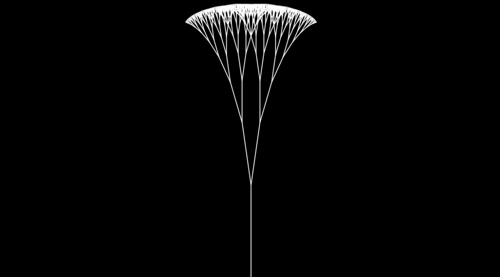
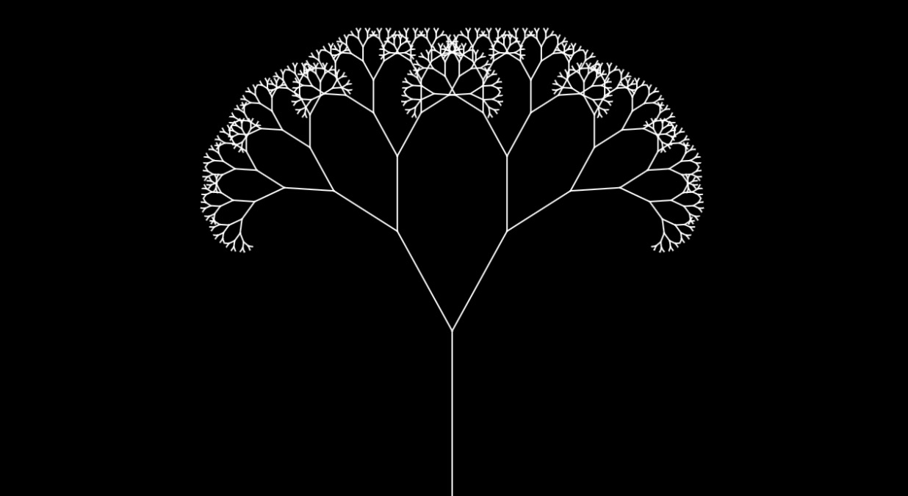
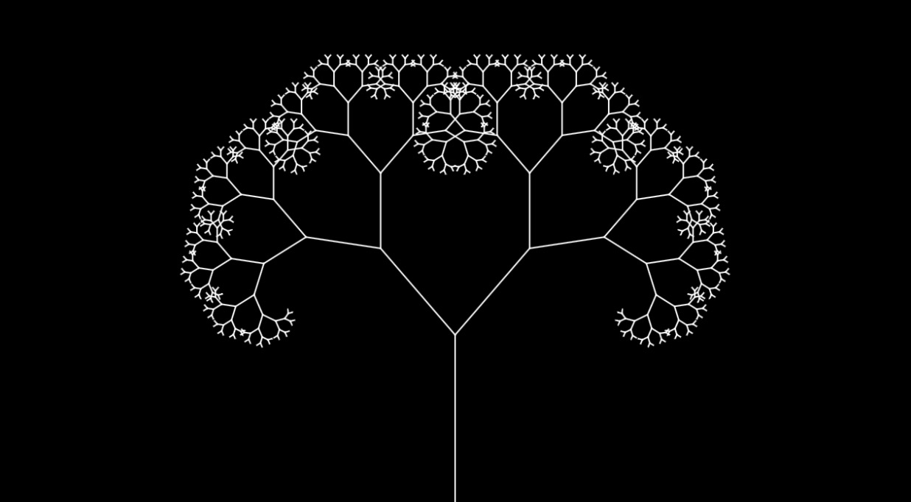

# zren0057_9103_tut6

- Part 1: Imaging Technique Inspiration
    - 1.1
    In the project created by Daniel Shiffman, I noticed a digital artwork called “Recursive Tree”. 
    I was inspired by the use of transformations and effects in this artwork.
    - 1.2
    The use of transformations and special effects techniques in p5.js increases the dynamism and interactivity of the artwork, allowing viewers to see the constant movement and change of the graphics, thus enhancing the visual appeal. Secondly, by precisely controlling the position and morphological transformation of each element, artists can accurately simulate complex natural and abstract forms in digital space, which is often difficult to achieve with traditional static art forms. This technology allows for greater flexibility in the creative process of our final assignments, as we can experiment with different visual effects and quickly iterate on designs.
    - 1.3
    
    
    

- Part 2: Coding Technique Exploration
    - 2.1
    A very useful way to implement transformations and effect imaging techniques is to use matrix transformations for complex transformations such as translation, rotation, scaling, etc. for both 2D and 3D graphics.
    - 2.2
    The translate() and rotate() functions allow you to move and rotate shapes on the canvas, making it easy to create complex rotating shapes and abstract forms. This is especially useful for reproducing the dynamic elements and abstract forms in Pacita Abad's Wheel of Fortune.
    - 2.4
    Screenshot for code:
    
    Example implementation:
    [Recursive Tree](https://processing.org/examples/tree.html)
